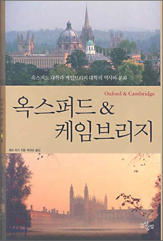
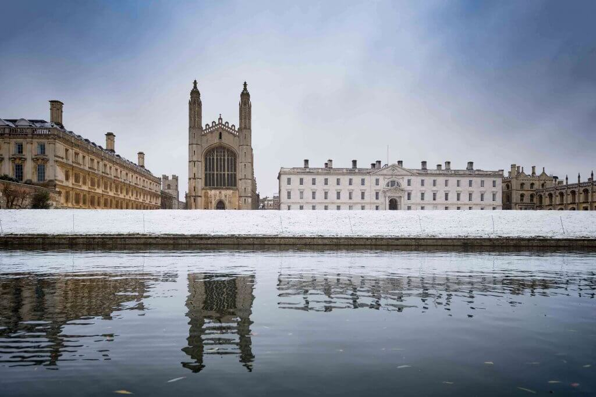

```{r setup, include=FALSE}
knitr::opts_chunk$set(echo = FALSE)
```

## Cambridge Tour

안녕하세요 여러분! 케임브리지 투어에 참석해주셔서 진심으로 감사드립니다.
<!--개인적으로 학생 신분으로 마지막 관광안내가 될 것 같아서--> 제가 이렇게 블로그 형태로 작성하였으니 나중에 다시 보고 싶으실 때 참고해주세요!

금일 관광일정은 다음과 같습니다.

* 관광 소요시각: 2-3시간
* 관광 장소: 코퍼스 시계, 이글 펍, 렌 도서관, 곤빌 앤 키즈, 트리니티, 세인트 존스


### **What to look at?**
* 컬리지 설립자가 누구인가: 성직자, 왕족, 시민, 의사
* 건축물 양식이 어떤가: 고딕, 로마네스크, 긴 창문과 벽돌
* 계급의 상징: Court와 Grass
* 계급: 노블맨, 펜셔너, 사이저


## 참고서적

* 옥스포드와 케임브리지
* 위키피디아
* 나무위키
* 그외 블로그 컬리지 홈페이지
```{r}

```

## 지도

지도는 다음과 같습니다.


```{r map}
library(leaflet)
leaflet() %>%
  addTiles() %>%  # Add default OpenStreetMap map tiles
  addMarkers(lng=0.11756, lat=52.20382, popup="Meeting Point")

```


## 들어가며

### Q. 케임브리지에 대해서 알려주세요.

케임브리지는 Cam강과 Bridge의 합성어입니다. 너무 간단하죠?
또한 영국 내에서 다리이름이 붙어있는 유일한 주랍니다.
그 다리는 어디있나하면 모들린 컬리지(Magdalene College)근처에 있는 다리랍니다.


### Q. 케임브리지랑 옥스포드는 컬리지 시스템이라는게 있다던데요, 그게 무슨 말인가요?

```{r}

```

당장 입학 지원서를 작성할 때에도 컬리지를 대뜸 선택하라고 합니다. 대략난감한 상황이 시작된 것이죠.
한국사람 입장에서는 대학 - 단과대학 - 학과의 위계가 수직적으로 이해되실 거에요.
그러나 옥스브리지에서의 컬리지는 조금 개념정의가 달라요.

여기에서 말하는 컬리지 시스템(Collegiate System)이란, 대학의 기능이 대학본부와 대학소속의 컬리지로 구분된 것을 의미합니다. <br>
* 교육과 연구의 기능: 대학본부, 연구기관, 도서관, 학과에서 담당
* 복지, 행정, 심화학습의 기능: 학생 (학석박 과정 모두 해당), 연구원 및 교수 (일부해당)의 숙소, 각종 행정처리, 장학 등 담당

따라서 케임브리지의 경우, 대학본부와 31개의 컬리지로 이루어져 있으며 이 32개 기관이 각자의 독립된 행정과 복지를 담당하게 됩니다.

이 전통은 대학설립 때 수도사들의 신앙과 지식의 향상과 엄격한 생활규율을 유지하기 위한 수단으로 만들었고요, 오늘날에도 비슷한 기능을 담당하고 있습니다.

**그게 나랑 무슨 상관이냐고요?**.

학부생의 경우, 컬리지 단위로 모집학과 학생이 정해져 있어 학생의 선택에 따라서 자주 만나는 친구들 무리가 달라질 수 있고요,
컬리지의 재정상황에 따라서 복지혜택도 그만큼 달라지기 때문에 장학혜택 또한 달라질 수 있답니다. 물론 빵빵한 컬리지의 경쟁률은 엄청나게 치열하죠.
한국에서는 학과에서 학번별로 담당지도교수가 있어요, 주로 졸업과 진로 이야기를 위한.

케임브리지 컬리지에서는 학부생을 위해서는 Director of Studies (DOS), 대학원생을 위해서는 Graduate Tutor 제도를 두고 있어요.
학생의 학업성취도를 진단하고 평가하기 위한 건데요,
학생이 공부를 못따라가면 사람을 연결해서 도움을 줄 수가 있고,
종교적 정신적으로 어려움이 있는 경우에는 친절한 상담을 통해 학업에 이상이 없도록 도와줍니다.
장애학생의 경우에는 강의실까지 이동편의를 위해 택시 서비스를 제공하기도 하며,
연말시험을 학과 시험장이 아니라 컬리지 내 별도의 장소에서 시험을 볼 수 있게 허락해줍니다.
연구얘기는 하나도 없습니다^^.

이 제도가 별것 아닌것 같지만, 경험상 컬리지 제도는 학생에게 득득득!


### Q. 몇개의 컬리지가 있나요?

* 컬리지 31개 - 한때는 34개
* 처음 설립된 컬리지들 중에는 Hall이라고 불렸던 것들이 많다
* 의미는 원래 홀에서 생활하는 학생과 펠로들을 지칭하는 말이었음
* 처음 '홀'의 명칭을 사용하는 컬리지는 트리니티 홀, 휴즈 홀


## 케임브리지에 대하여

### Q. 케임브리지 대학은 언제 설립되었나요?

케임브리지 대학은 1209년에 설립되었어요. <br>
첫 컬리지 설립은 1284년 Peterhouse를 시작으로 2010년 Homerton이 31번째로 설립되었답니다.
첫 컬리지 설립 전까지는 사람들이 교회 강당에 모여서 강의하고 토론 하였답니다.


그래서 **성자와 학자의 도시** (The city of Saints and Scholars)라고 합니다.


### Q. 어떤 계기로 설립되었나요?

* 왜 옮겨왔나? 학교태동시점부터 학생vs시민 갈등이 많았음.
* 1209년에 부녀자를 살해한 사건으로 옥대 교수 및 학생들이 자유롭게 공부할 곳을 찾아 케임브리지로 오게 됨 (1차).
* 1355년 옥대 학생들이 맥주맛에 불만을 느껴 주인얼굴에 뿌린사건이 발단이 되어 시민vs학생사이에 전쟁이 일어나 사망자 발생(2차).
* 수습하는 과정에서 재판 및 벌금부과 문제로 당시에 도시와 대학간 감정이 좋지 않았고 옥vs캠 싸움으로 번지게 됨.


### Q. 옥스포드, 혹은 다른 상업도시도 있었을텐데 왜 대학이 케임브리지에 새워졌을까?

* 여러 의문점이 있지만 한가지 분명한 사실은 이곳에서 교수와 학생공동체가 국왕과 교회로부터 확실한 보호를 약속받았다는 점이다
* 대학에 대한 시민들의 위협이 심각했다


## The College of Corpus Christi and the Blessed Virgin Mary (줄여서 코퍼스. 뜻: 그리스도의 몸)
* 설립년도: 1352년 (6번째 오래된 컬리지)
* 시민들에 의해서 설립
* 흑사병으로 인해 코퍼스+버진메리 길드의 사람들이 합쳐서 만들었음
* Old Court (14세기 느낌 그대로)
* 화장실 X, 난방시설 없음, 홑겹창문이었으나, 현재 부분적으로 이중창 설치됨
* 이원화 캠퍼스 in Leckhampton

```{r}
knitr::include_graphics("images/corpus.jpg")
```


### Parker 도서관
* 1376년 준공
* 컬리지 대표 1544-1553
* 당시 학교총장이었던 앤볼린의 교구 목사(채플린) 1559-1575
* 도서 컬렉션이 특별한 것은 안 파커는 활자로 된 모든 문서 반출을 금했으며, 만약 일정 수의 책이 분실될 시, 관내 모든 책들을 Gonville and Caius College로, 거기서 더 잃어버리면 Trinity Hall로 소유를 넘기겠다고 했음

```{r}
knitr::include_graphics("images/parker.jpg")
```

### 코퍼스 시계

24K 금덩이 시계는 발명가이자 명예교수인 John Taylor가 제작하셨고 사비 £1M(한화15억원)를 투자하셨다. 놀랍게도 이 시계는 08년 타임지가 선정한 올해의 발명품으로 선정되었다. 당장 질문이 나온다, 대체 왜? 올해의 발명품 정도 되려면 아무래도 공학적의미 외에 사람들의 심금을 울리는 메시지가 필요했을 것이다. 이 중 일부만 소개한다(위키에 다있다).

우선 시계에 가장 눈에 띄는 것이 있다. 그렇다 시계 상단에 자리하고 있는 흉측한 곤충이다. 존은 이 메뚜기를 가리켜 Chronophage (라틴어로 크로노파지)라고 하였고, 이를 영어로 번역하면 time eater이다. 메뚜기가 입을 벌리면서 초침을 움직이는 장면을 빗대어, "time is not on our side"라고 얘기했으며 우리의 시간이 잡아먹히는 중이라고 하였다. 눈은 이따금씩 깜빡이는데 이것은 시간을 잡아먹는 크로노파지가 만족하는 모습을 일컫는단다. 꿈보다 해몽이다 크..역시 발명가 크라스.

중간지점에 살펴보면 LED등으로 비춰진 시,분,초침이 있다. 가장 안쪽에 시침, 다음 분침, 끝에는 초침으로 되어있고, 초침은 정신없이 뱅글뱅글 돌아가고 있다. 한가지 특이점은 초침의 괴이한 이동패턴이다. 무슨 말이냐 하면 초침이 다음 초침까지 한칸씩 이동하는 것이 아니라 한바퀴 뱅글돌아서 이동한다는 것이다. 그래서 이 시계의 초는 원래 시간보다 대략 6배정도 느리게 된다. 이 시간지연 현상은 5분마다 한번씩 진자가 재정렬을 하면서 해결이 된다. 존은 이 이 과정을 빗대어 인생의 불규칙성이라고 말한다. 그리고 관광 찌라시에 따르면 진자 재정렬 과정 중 득득득 하는 소리는 마치 관이 가까이 당기는 것과 같은 섬뜩한 느낌을 준다고 한다. 갖다 붙인 것 같기도 한데 상상력으로 인정.

하단에는 라틴어로 무언가가 쓰여였다. mundus transit et concupiscentia eius ("the world passeth away, and the lust thereof"). 그렇다. 신실한 기독인이었던 존은 요일2:17의 성경말씀 "이 세상도 그 정욕도 지나가되 오직 하나님의 뜻을 행하는 이는 영원히 거하느니라 (새번역 성경)"라고 적었고, 이를 의역하면 영원하신 하나님 나라 소망하며 매일의 삶속에 하나님 뜻 따라 살아라는 소리이다. 그러나 제막식에 무신론자이신 고 스티븐 호킹 교수가 이 얘기는 쏙 빼놓고 열심히 살아라는 투의 불완전한 해석을 해버린 바람에 의미전달이 지금까지도 안되고 있다.


## Old Cavendish Lab
### 캐빈디시 연구소 설립
* 1873년 열었음
* The Cavendish Laboratory was founded in the late 19th century, with a generous donation by the University Chancellor(총장) William Cavendish, in order to upgrade the pursuit of sciences in Cambridge. Discoveries such as DNA, the Neutron and Electron have been made within these buildings
* 시편111:2: 여호와께서 행하시는 일들이 크시오니 이를 즐거워하는 자들이 다 기리는도다
* 당시 19명의 연구진 밖에 없었음
* 19세기 중반에 처음으로 자연과학을 졸업시험으로 치르는 정식학과로 채택

```{r}
knitr::include_graphics("images/cavendish.jpg")
```

### West Cambridge로 이사
* 1973년 연구소가 설립된 지 100여년 만에 West Cambridge로 이전
* 현재 이 지역은 New Museum Site로 불림
* 동물학과 흉물스러운 콘크리트 건물
* 휘플 과학사 박물관

```{r}
knitr::include_graphics("images/newcavendish.jpg")
```

### Downing Site
빠르게 성장하는 자연과학 분야를 위해 대학은 1900년 무렵에 맞은 편 다우닝 컬리지 땅을 매입
1910년 경 다우닝 싸이트 건설 -> 혼잡 그 자체
세지윅 지구과학 박물관은 세계에서 가장 많은 화석 표본들이 수집되어 있는 곳으로 유명

```{r}
knitr::include_graphics("images/downingsite.jpg")
```


## The Eagle Pub: Discovery of DNA (owned by Corpus)
* 캐빈디시 건물에 딸린 자전거 창고에는 1947년부터 분자생물학의 전설적인 실험실이 차려짐
창고를 개조한 이 연구소에서만 13개의 노벨상
* 프랜시스 크릭 (35세, 박사학위 없는 연구원)과 제임스 왓슨(23세 조류학자)의 합류
* DNA의 이중나선 구조발견: 뒤틀림과 안정성 -> 1page paper였지만 유전학에 지대한 영향
* 2차 대전 후 물자가 부족했던 영국에서는 대학 한군데만 비용지원하기로 약속하였고, 로잔 프랭클린이 속했던 킹스칼리지에서 연구비 획득
* 로잔 프랭클린
* [기사원문](http://www.hani.co.kr/arti/science/science_general/316108.html)


```{r}
knitr::include_graphics("images/eagle.jpg")
knitr::include_graphics("images/eagle1.jpg")
```


## Great St.Mary’s 교회
케임브리지 대학의 Great St. Mary 교회는 11 세기에 지어진 건물이다.
이곳은 에라스무스, 크랜머, 리들리, 라티머 같은 종교개혁자들이 설교한 곳이기도 하다. 이 교회는 한때 비국교도인 청교도와 영국 국교회의 전쟁터 같은 곳이기도 했다.
청교도 올리버 크롬웰(케임브리지 시드니 써섹스 대학 출신)이 이끄는 시민혁명기간에 케임브리지 시민들 대부분은 크롬웰의 군대를 지지했지만, 대학의 학자들은 차알스 1세 왕을 지지했기에 그 두 세력간의 충돌은 불가피 했다고 전해진다. 그 이유는 St. Mary 교회가 지역주민들이 다니는 교구 교회이기도 한 반면, 동시에 대학교회였기 때문이었다.
크롬웰의 군대는 국교회의 기도 예식서를 찢기도 했고, 스테인드 글라스를 제거하고, 강대상을 중심에 갖다 놓기도 했다. 이것은 왕과 영국국교회를 지지하는 학자들의 반발을 사기도 해서 충돌이 자주 일어났던 것이다.
It is unusual for parish churches to have two organs
The datum point from which the first English milestones were measured in 1732.
15세기 올드 스쿨스가 지어지기까지 학장과 펠로들은 여기서 회의를 하곤 했음


### 종소리
* There has been bell-ringing since 1516
* 헨델의 메시아에서 나오는 내 구주 살아계심을 (I know that my redeemer liveth) 종탑에서 울림
* 웨스트민스터 차임: trinity hall 법학교수 조셉 조웨트 목사
* ‘Cambridge Quarters’ were the model for the ‘Westminster chimes’ of Big Ben which ring out worldwide.


## Gonville & Caius
### Overview
* 설립년도: 1348년  fourth-oldest surviving college
* 설립이 두 번에 걸쳐 이루어짐
* Edmund Gonville(동잉글랜드 성직자) → William Bateman → John Caius(의사)
* Caius: 곤빌 홀과 파두아에서 의학 공부한 뒤에 이태리에서 몇 년간 철학을 가르치며 지내다가 런던에서 의사로서의 활동을 본격적으로 시작했음
* Great Gate
      * (좌) Caius: academic costume/holding the gate of Honour
      * (우) Bateman: 교황의 가운 동상들고있음
      * (하) Gonville: 성스러운 가운/학자의 모자
* When Gonville died three years later, he left a struggling institution with almost no money.
* The executor of his will, William Bateman, Bishop of Norwich, stepped in, transferring the college to its current location. He leased himself the land close to the river to set up his own college, Trinity Hall, and renamed Gonville Hall The Hall of the Annunciation of the Blessed Virgin Mary. Bateman appointed the first Master of the new college his former chaplain John Colton, later Archbishop of Armagh.
* Caius did, however, found the college as a strong centre for the study of medicine, a tradition that it aims to keep to this day.
* Gonville & Caius is one of the wealthiest of all Cambridge colleges with net assets of £180 million in 2014

### 키즈가 내세운 여러가지 조건들

* By the sixteenth century, the college had fallen into disrepair(황폐화), and in 1557 it was refounded by Royal Charter as Gonville & Caius College by the physician John Caius. John Caius was master of the college from 1559 until shortly before his death in 1573. He provided the college with significant funds and greatly extended the buildings.
* 까다로운 입학조건: He insisted that the college admit no scholar who “is deformed, dumb, blind, lame, maimed, mutilated, a Welshman, or suffering from any grave or contagious illness, or an invalid, that is sick in a serious measure”.
* Caius가 지은 코트는 케임브리지에서 처음으로 3개의 익랑으로만 이루어진 코트
* 남쪽에는 담장을 쌓고 문을 냈다
* 밝고 개방적이며 공기가 잘 통하도록 한 코트 구조는 곰팡내 나는 중세를 몰아내겠다는 상징적인 의미

## Four Gates
* 키즈 박사는 엘리자베스 시대 인문주의자가 지녀야 할 교양의 요건을 뜻하는 4개의 문을 세움
      * Humilitatis: 겸손의 문
      * Virtutis: 미덕의 문
      * Sapientiae: 지혜의 문
      * Gate of Honour: 영광(명예)의 문
      * 문을 지나면 바로 Old school로 입장가능
* 영광(명예)의 문은 단 두 번만 열린다
      * 학위수여식
      * Fellow 사망 시: Steven Hawking


## Trinity (College of the Holy and Undivided Trinity, 거룩한 삼위일체의 컬리지)
### Overview
* 헨리 8세에 의해 1546년에 창설됨
* 2008년을 기준으로 31명의 노벨상 수상자와 필즈상 수상자, 아이작 뉴턴 등 수많은 유명 인사를 배출한 칼리지이다
* 옛컬리지 2개 마이클하우스 + 킹스홀을 허물고 지었음
* 트리니티 컬리지는 유일하게 근래까지 펠로우들이 학장을 선출하지 않고 총리의 추천을 받았음 지금은 명목상으로 지원

* 주요인물
* 시인 바이런
* 국왕 에드워드 7세, 조지 6세
* 철학자 버트란드 러셀, 비트겐슈타인

* 뉴턴의 사과나무
      * 정문 옆 사과나무: 1954년에 원래 집에서 꺽꽂이한 것 -> 도저히 먹을 수 없는 사과
      * 사과나무 종류: Flower of Kent
* 뉴턴
      * 일생 중 35년을 Trinity College에서 재학
      * 1669년에 그의 지도교수는 제자가 능력이 더 뛰어나다는 이유로 27세 뉴턴에게 수학과 교수직을 주고 은퇴
      * 시간과 공간에 대한 새로운 이해의 토대를 마련해 준 그의 자연과학 논문들이 여기서 탄생
      * 알렉산더 포프의 헌사: 자연과 자연법칙은은 어둠속에 묻혀있었다. 그때 하느님이 뉴턴이 있으라 하셨다. 그러자 모든 것이 밝아졌다.
* Great gate
      * 에드워드 3세가 설립한 입구를 그대로 유지
      * 에드워드 3세의 문장을 중심으로 6아들들의 문장이 있음

### Great Court
* The Great Court Run involves attempting to run around Great Court within the length of time that it takes the College clock to strike the hour of twelve, including the preparatory chiming of the four quarters and the two sets of twelve. (The clock strikes each hour twice.) The course is approximately 370 metres long.
* Depending upon the state of winding, the clock takes between about 43 and 44½ seconds. It is traditional for athletically-inclined members of Trinity to attempt the run every year at noon on the day of the Matriculation Dinner. The Great Court Run forms a central scene in the film Chariots of Fire (David Puttnam, 1981) (although it was not in fact filmed at Trinity).
* In October 1988 the race was recreated for charity by Britain’s two foremost middle-distance runners at that time, Sebastian Coe and Steve Cram. The decathlete Daley Thompson was a reserve. Starting from under the clock-tower and running anti-clockwise, the runners restricted themselves to the customary course dictated by the the flagstones between the cobbles, and hence had to turn very sharply at each corner. Coe won, with his time of 46.0 seconds beating Cram’s of 46.3 seconds. Neither runner, however, beat the clock, which took 44.4 seconds.

### Wren Library
* Winnie the Pooh원고: 알렉사더 밀른
* 존 밀턴과 앨 프리드 에드워드 하우스먼의 육필로 된 시
* 뉴턴의 머리카락
* 최초의 민속언어인 영어를 사용하여 당시 궁정언어(불어)를 몰아내는 데 기여했던 작품 농부피어스(Piers the Plowman)의 14세기 판본


## The Master, Fellows and Scholars of the College of St John the Evangelist in the University of Cambridge (케임브리지 내 학장, 펠로우, 그리고 학자들로 구성된 전도자 성 요한의 컬리지)
### Overview
* 설립년도: 1511, 마가렛 뷔퐁 여사 헨리7세 어머니 (Christ college도 세움)
* The Great Gate(정문)은 1516 년에 완성: William Swayne
* 트리니티처럼 현관에서부터 설립자들의 모습을 거창하게 소개하고 있음
* 조각은 The Foundress, Margaret Beaufort 여장의 문장입니다. 양쪽에있는 호기심 많은 동물들은 Yale이라는 상상의 동물 (코끼리의 꼬리, 영양의 몸과 염소 머리를 가지고있는 신화) 뿔은 앞뒤로 움직일 수 있습니다!
* 금으로 장식된 인물
* 왕실의 설립자가 아님
* 컬리지의 수호성인 St.John 동
* 그의 발 앞에는 성도의 전통적인 상징 인 독수리가 있습니다. 그는 뱀의 형태로 독을 매혹시킨 다음 안전하게 마셨다는 전설을 나타내는 뱀과 함께 중독 된 성배를 들고 있습니다.
* Court는 총 11개

### First Court(채플)
* 입구: 존 피셔와 뷔퐁여사
* 휴 애쉬튼 석관 (1522년 사망)
* 그의 이름을 상징하는 무늬들이 수수께끼처럼 장식. 서양물푸레나무(Ash)가 큰 통(Tun)에서 자라나는 것을 나타냄
* 묘비에는 두개의 초상이 있음 → 인생의 의미와 무의미
* 아직도 학장을 선출할 때는 펠로들이 채플에서 회합을 갖는다
* Wilberforce
* Second Court: Shewsbury’s Tower (감시용) - First Court와 완벽한 대치
* Bridge of Sighs (탄식의 다리)
* the only respect in which it really resembles the Bridge of Sighs in Venice, which acquired its name because it really led to the prison
* Queen Victoria admired the bridge greatly - so pretty and picturesque - and the combination of the brick gables of Third Court, New Court and the Bridge of Sighs constitutes for many an epitome of the Cambridge scene.

### New Court: Wedding Cake
