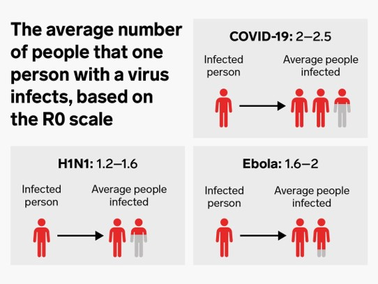

```{r setup, include=FALSE}
knitr::opts_chunk$set(echo = FALSE)
```

# 머리말

코로나 바이러스 (SAR-COV-2)는 2019년 12월 중국 우한시에서 최초 발생하였으며, 2020년 5월 현재 중국을 넘어 전세계 212개국 30만 명의 목숨을 앗아갔다. 
국내에는 1월 20일 우한에서 입국한 중국여성의 확진판정을 시작으로 확진자가 꾸준히 증가했으며, 2월에는 지역사회 감염이 본격화되면서 하루 최대 천명에 육박할 정도로 폭발적인 증가를 기록한 이후, 현재 소강기에 접어들었다. 
정부는 지난 4개월 동안 코로나 확산방지를 위해 선별진료소 설치, 감염경로 역학조사, 공적 마스크 제공, 사회적 거리두기, 해외입국자 의무 자가격리 등 각고의 노력을 하고 있으며, 민간 차원에서도 코로나 맵과 마스크 알리미 등 국민들의 안전에 크게 기여하였다.


코로나 대유행이 시작되자 전세계 학계와 산업계에서는 전염병모형을 개발하여 코로나 확산 예측 및 저지를 위해 심혈을 기울이고 있다. 
특히 슈퍼전파자의 이동, 자가격리자의 이탈이 집단감염에 단초가 되면서 개인의 이동 행태를 빠르게 추적하는 것이 전염병 조기억제에 중요한 변수로 자리 잡았다. 
이와 같이 개인의 행태적 특성과 공간적 이동을 반영할 수 있는 모형 중에서 행위자기반모형(Agent-based modelling)이 있다. 
이 글에서는 국내 코로나 바이러스의 확산과정을 탐색하고, 사례를 통해 행위자기반모형이 질병 통제에 어떻게 적용될 수 있는지 살펴보고자 한다.


# 코로나19의 확산단계와 경로
2020년 1월 20일 국내에서 최초로 발생했던 코로나19는 한 달여 기간 동안 수도권 및 전국 각 지역에 산발적으로 분포했다 (확산1단계). 
이 기간 동안 확진자들의 경로추적이 가능했다. 확산2단계는 집단감염을 촉매로 확산이 폭발적으로 증가하는 시기로 지역사회 감염이 급증하는 시기였다. 
대구 신천지교회 신도 사이에서 급속도로 확산된 바이러스는 2월부터 3월까지 대구 경북지역을 중심으로 9800명, 당일 확진자 최대 1000명, 그리고 누적사망자는 150여 명을 기록하였다. 
4월 초부터 5월 초 현재까지는 바이러스 확산이 잦아드는 확산3단계로, 일평균 확진자가 30명 이하로 줄어드는 시기이다. 해당기간동안 서울 및 수도권에서 소규모 집단감염이 수차례 발생하였으며, 확진자 대부분은 해외교민이었다.


질병관리본부는 코로나의 주 확산경로를 사람 간의 비말감염 혹은 밀접접촉을 통한 전파 혹은 오염된 표면이나 물체와의 접촉에 의한 전파로 분석하고 있다. 
바이러스 감염 시 대개 1-14일 정도의 잠복기 후 기침, 발열, 호흡곤란 등의 증상을 보이지만 간혹 무증상자들도 있다. 
국내언론 및 외신에 의하면 연령이 많고 기저질환이 있는 사람일수록 감염에 따른 사망 가능성이 높아진다는 보고가 있었다. 
실제 유럽과 미국 양로원에서는 코로나 확진 판정 이후 사망하는 사례가 수십 건이 있었고, 국내에서는 요양병원 내 확진자들 중에서 고위험 환자들이 사망했다. 
그럼에도 국내에서는 비교적 마스크 착용, 방역, 확진자 경로공개 등 코로나 확산을 선제적으로 방어한 까닭에 이동제한(Lockdown) 없이도 일상생활을 이어가고 있으나, 코로나 바이러스의 높은 전파력으로 인해 밀접접촉 가능성이 높은 교회, 실내운동시설, 콜센터, 유흥업소 등 실내 다중이용 시설은 여전히 긴장의 끈을 놓지 않고 있다.


```{r fig.cap="Cases and Deaths in South Korea"}
knitr::include_graphics("fig1.png")
```
<aside> 국내 코로나 바이러스 확진자 및 사망자의 누적 추이 </aside>


# 사회 시뮬레이션과 행위자기반모형

사회 시뮬레이션 (Social Simulation)은 각종 컴퓨터 기법을 활용하여 사회현상을 설명하는 모형으로, 사회현상과 비슷한 환경을 실험실처럼 조성하여 다양한 실험을 수행한다. 
대부분의 실험은 'What if' 시뮬레이션, 즉 어떠한 조건을 변화할 때 결과가 어떻게 달라지는 지를 검증하는 모형 하에서 수행된다.
[-@Murray2016] 는 시뮬레이션 기법은 마치 타임머신을 타고 돌아가서 상상하기에 좋은 도구이며, 미래에 발생 가능할 상황에 대한 해답을 제시할 수 있는 방법으로 언급하였다.


사회 시뮬레이션 중에서도 행위자기반모형 (Agent-based modelling, ABM)이란 복잡한 거시적 사회현상을 개별 행위자들이 이동과 상호작용으로 설명하는 모형이며, 행위자는 분명한 규칙과 목적을 갖고 있다 [@Batty2007; @Gilbert2008; @park2015]. 
본 모형은 개별 행위자들의 상태와 이동에 초점을 맞추는 특성으로 인해 미시적모형 (Microsimulation) 혹은 상향식 (Bottom-up) 모형으로 분류된다. 
행위자기반모형은 전염병 확산 뿐 아니라 토지이용변화, 소비시장, 금융, 교통 및 보행자 통행 등 분야를 가리지 않고 사용되고 있다.


그렇다면 행위자기반모형이 전염병모형에 유용한 이유는 무엇일까? 
우선 코로나 바이러스처럼 원인규명이 쉽지 않고 임상연구가 어려울 경우에 효과적이다. 
물론 감염속도, 접촉확률, 잠복기, 면역력, 재생산 비와 같이 다양한 변수를 고려하면 보다 견고한 모형이 될 수 있지만, 행위자기반모형의 관심은 '위험인자(Risk Factor)'의 정확한 가정과 민감정도를 파악하는 것이다. 
예를 들어, 전체 인구 중 취약인구의 거주지와 이동패턴은 어떠한 지, 감염자가 어떠한 과정으로 감염시키는지, 감염자들의 회복 혹은 사망은 어떻게 결정하는지를 모형에 대입할 수 있다. 
또한 모형을 일단 구축해 놓으면 얼마든지 유사연구에 접목할 수 있으므로 적용가능성 측면에서 우수하다. 
끝으로, 행위자기반모형은 전염병의 시공간적 확산을 시각적으로 제공한다는 장점이 있어 사용자들에게 효과적인 정보전달이 가능하다.


이와 같은 특성을 바탕으로 행위자기반모형이 실제 사회현상을 어떻게 다루었는지 사례를 통해서 살펴보겠다.


## 실험모형: 코로나 확산 
<aside> Washington Post 3월 14일자: Why outbreaks like coronavirus spread exponentially, and how to “flatten the curve”. 중앙일보는 해당기사를 모션 시뮬레이션으로 번역하였는데 이는 잘못된 표현이다. </aside>

지난 3월 14일, 워싱턴 포스트는 행위자기반모형을 활용하여 코로나19의 확산의 심각성과 방지대책을 기고하였다. 
이는 학계 밖에서 행위자기반모형이 사용된 최초의 사례로 추정된다. 
본 모형은 1) 자유로운 이동, 2) 지역봉쇄, 그리고 3) 사회적 거리두기를 각각 시행했을 때 전염병의 확산속도를 비교하여 세간의 주목을 받았다.


## 실험의 가정
모형내부의 가상세계에는 전체 인구 200명이 존재한다. 
편의상 감염가능군(Susceptible)을 파란색 공, 감염군(Infected)는 노란색 공, 그리고 회복군(Recovered)은 분홍색 공으로 표시하였다. 
개인은 자유롭게 이동할 수 있으며, 무작위로 선택된 한 명은 코로나에 감염이 된 상태이다. 
실험모델의 특성상 비말을 통한 감염재생산 수(R0)^[감염재생산수 (Reproduction number): 감염자가 없는 인구집단에 처음으로 감염자가 발생하였을 때 첫 감염자가 평균적으로 감염시킬 수 있는 2차 감염자의 수] 가 반영되지 않았으나, R0이 2명 이상인 @Wu2020 와 그림 2를 참고했을 때, 감염군이 감염가능군과 접촉 시 감염군으로 전환하도록 설정하였다. 
또한 감염환자들은 모두 경증에 자연치유가 가능하며, 재감염이 없다. 
이 기사에서는 자연상태, 강제봉쇄, 그리고 사회적 거리두기의 실험을 진행하였다. 각 실험은 25초동안 진행되었다.

```{r fig.cap="R0"}

```
<aside> 코로나19 바이러스(우측상단)와 다른 바이러스 간 감염재생산 수 비교. 코로나19 바이러스 감염자는 평균 2-2.5명을 감염시킬 수 있으며 이는 다른 감염병보다 높은 수치이다 (Business Insider 2020.04.18 기사삽입</aside>


## 실험 (가): 격리조치 없는 자연상태 (Free for all)
이 실험에서는 확진자의 격리조치가 없이 개인의 자유로운 이동을 가정한다. 
이 때 개인은 서로 이동하면서 자연스레 상호작용 (공이 부딪히는 현상)한다. 
상호작용은 대화가 될 수 있고 악수나 포옹의 신체적 접촉이 될 수 있다. 
감염군 (노란색 공)은 감염대상군 (푸른색 공)과 자연스럽게 접촉하게 되면서 7초 이후로 확진자들이 빠르게 증가하였고 16초 전후로 감염대상군이 모두 감염되었다. 


## 실험 (나): 지역봉쇄 (Attempted Quarantine)
두 번째 지역봉쇄 실험은 가상의 벽을 설치하여 모형 초반(1-5초)에는 확진자가 있는 좌측 벽에서 감염자들이 속출하다가 벽이 서서히 열리면서 전체 지역으로 확산되는 상황을 모의하였다. 
해당실험의 감염속도가 이전 실험보다는 더딘것은 사실이나, 봉쇄가 해제되고 20초만에 감염대상군 전체가 감염된 한편, 감염군 중에서도 회복된 사람도 서서히 증가하였다.  


## 실험 (다) - 사회적 거리두기 (Social Distancing)
마지막 사회적 거리두기 실험은 전체 공의 25%만 이동할 때와 (Moderate Distancing) 그 절반인 12.5%만 이동할 때 (Extensive Distancing)의 확산을 비교하였다. 
Moderate Distancing 실험은 14-17초 사이 최대 70명이 감염되었고 서서히 줄어들어 44명에서 종료되었다. 
반면 Extensive Distancing 실험에서는 중반부터 모델이 종료되는 시점까지 감염자는 18-22명을 유지하였다. 


## 시사점
실험결과, 사회적 거리두기 실험이 나머지 두 실험에 비해 바이러스 억제에 효과를 보이는 것으로 밝혀졌다. 
즉 사회적 거리두기를 하되 인구의 이동이 적을수록 확산을 저지할 수 있다는 것이다. 
기사가 공개될 당시에는 아직 이동제한(Lockdown) 명령이 발효되지 않아서 실험에 포함되지 않았으나, 모형의 구조는 사회적 거리두기가 상당히 흡사할 것이다. 
위 모형이 추상적으로 설계되었기 때문에 현실과 다소 차이는 있으나, 비교적 간단한 조건으로도 '사회적 거리를 유지'하는 것이 얼마나 효과적일지 시사하는 바가 크다.


```{r}
knitr::include_graphics("fig3.png")
```


<aside> 행위자기반모형을 활용한 세가지 코로나19 확산모형 실험. (가) 자유이동, (나) 지역봉쇄, (다) 사회적 거리두기 </aside>


# 맺음말
2020년 상반기 전 세계는 보이지 않는 적 코로나 바이러스와 싸우고 있다. 그 여파로 인해 많은 사람들이 목숨을 잃었고 평범한 일상으로의 복귀는 아직도 조심스러운 실정이다. 
현재 각 국가는 코로나 확진자 및 사망자를 낮추기 위해 발 빠른 정책적 의사결정을 진행하고 있으며, 이 때 과학적 결과가 정책결정의 근거자료로 활용된다. 
실례로, 영국정부는 임페리얼 대학 퍼거슨 교수팀에서 행위자 기반 모형의 결과 50만 명 이상의 사망자가 발생할 수 있다고 발표한 직후, 코로나 확산초기 유지했던 '집단면역 (Herd Immunity)' 정책을 빠르게 철회하기도 했다.


이 글은 '행위자기반모형이 보건정책에 기여할 수 있을까'라는 질문을 던지며 시작한다. 
질문에 답변하기 위하여 행위자기반모형의 상위 범주인 시뮬레이션의 강점과 적용가능성을 살펴보았고, 두 실험사례를 소개하였다. 앞서 소개한 코로나모형이 정부의 정책실험의 효과를 확인하는 목적이라면, 나중에 소개한 구제역모형은 구제역의 전역적 확산을 결정하는 위험인자와 억제인자의 영향을 평가하는 점에서 차이를 보인다. 
두 모형은 공통적으로 실제 사례를 단순하지만 명료화 했다는 '예증모형 (Illustrative Model)' 측면에서 분명히 기여할 부분이 있다. 
퍼거슨 교수팀에서 개발한 행위자기반모형 (SIM-Nation)처럼 6500만명의 행태를 모의한 '설명모형 (Explanatory Model)'은 코로나 극복을 위한 자구책 마련에 힘을 보탤 수 있다.


행위자기반모형이 이번 코로나사태를 통해 주목을 받은 것은 사실이나, 이 또한 모형이므로 현실을 완벽하게 구현할 수 없다.
예증모형은 상황을 단순하고도 명료하게 전달할 수 있는 장점이 있지만 여러 제약조건으로 인해 객관적 사실을 예측하는데 무리가 따르며, 설명모형은 실제와 거의 흡사하다는 장점이 있지만 구축과정이 복잡하고 모형결과의 검증이 불분명해질 수도 있다 [@Edmonds2019]. 
이 때문에 연구자는 연구모형을 설계할 때 분명한 기회비용(trade-off)이 있음을 반드시 명심해야 한다. 
행위자기반모형, 네트워크모형, 확률모형(Stochastic model), 그리고 임상모형(Observational Model)은 각각 강점과 특색이 분명하고 정답이 없기 때문에 모델 선택에 적용에 세심한 주의가 필요하다. 
전세계는 지금 초미세먼지의 10% 크기의 코로나 바이러스와 총성 없는 전쟁을 치르고 있다. 
이와 같은 역사를 반복하지 않기 위해서는 학계와 산업계, 정부가 사전에 다양한 재난대응모형을 공유하여 미래에 철저히 대비해야 할 것이다.


