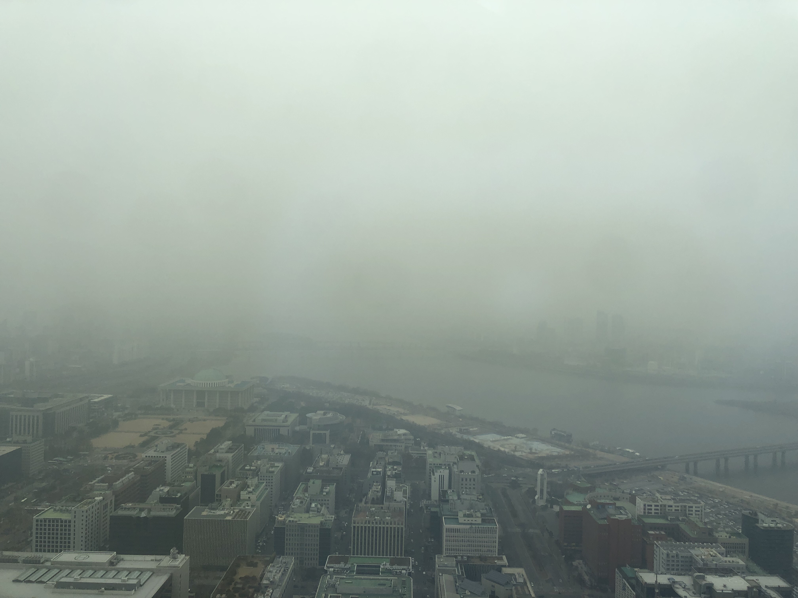
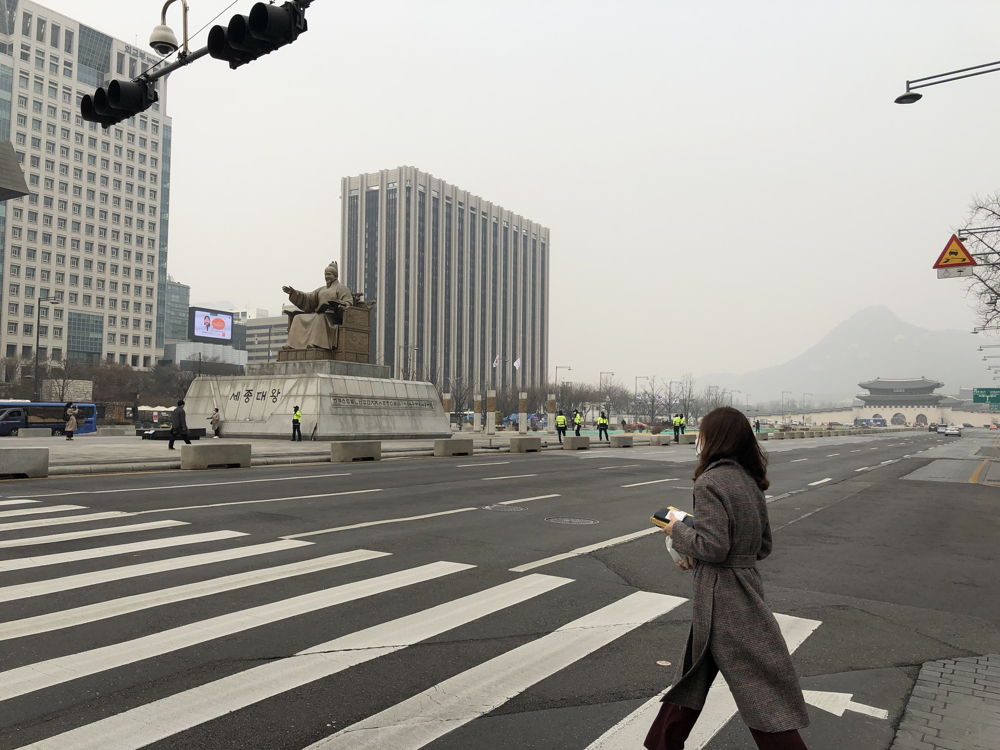

Some of you may heard about Seoul's air pollution at least once, but for those who never heard it before, you should see how severe the atmosphere is just by looking at the pictures below (Photos credited to Peter Han).

## Pic 1

This Photo was taken from the 50th floor of the IFC Building in Yeoido, Seoul on the 5th of March 2019. The dusty atmosphere restricts our vision too much that you can't clealy see the far end of the River Han. The levels of PM2.5 were peaked at 200µg/m3.

  

## Pic 2

A lady, wearing a mask and frowning, is crossing the road on a highly polluted morning. Location: King Sejong statue, Gwanghwamoon dae-ro, Seoul. PM2.5 levels at  140µg/m3 

